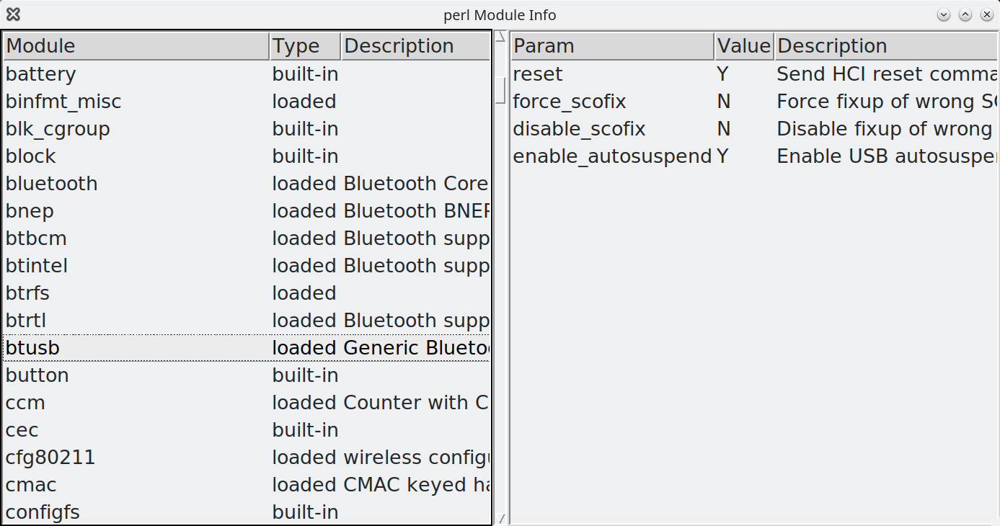

# pModInfo
## perl Module Info

Small script wrinting on Perl with user interface on TK.

This script show list of loaded and built-in kernel modules, modules param and param descriptions.

It can be runned without superuser priveleges, but some modules allow reading param values only for root.


On ubuntu you need install packages:

```
apt install perl-tk kmod
```

# ToDo

* TUI
* Support for other OS. than Linux


# Screenshot
