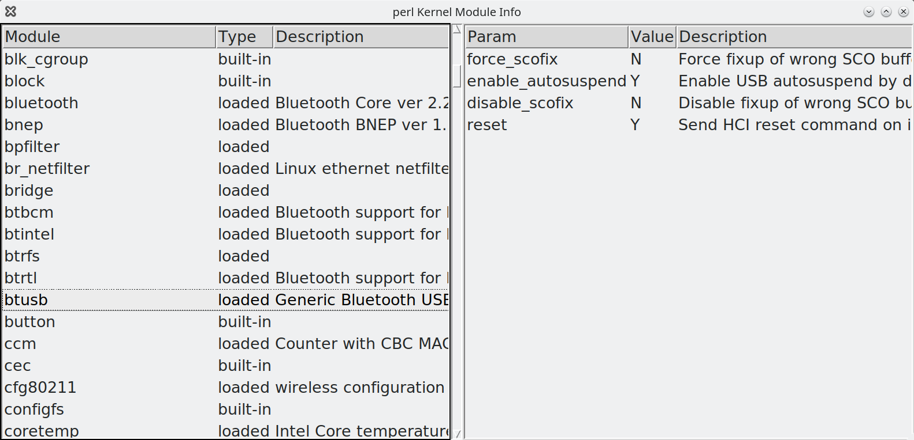

# pModInfo
## perl Kernel Module Info

Two small scripts writting on Perl. Both scripts have similar functionality and
difference only in user interface:

* pkmi-x.pl - have UI based on TK library and targeted for X-Window users
* pkmi-text.pl - have UI based on Cursers library and targeted for terminal users

Both scripts show list of loaded and built-in kernel modules, and available module
parameters with values and descriptions (if available).

They can be runned without root priveleges, but some kernel modules allow read
info only for root.

# Install
On ubuntu you need install packages:

```
apt install libcurses-ui-perl perl-tk kmod
```

# ToDo

* Support for other OS. not only Linux
* Handle terminal window resize in pkmi-text.pl
* Show module dependency tree

# Screenshot

## pkmi-x.pl


## pkmi-text.pl

