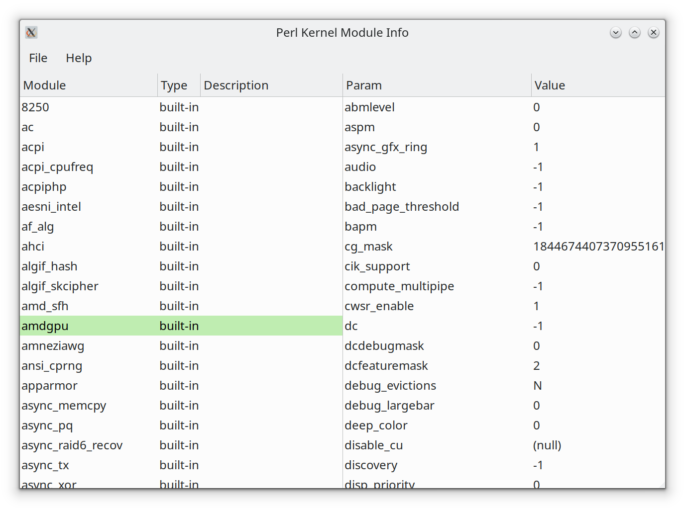

# pModInfo
## perl Kernel Module Info

Two small scripts writting on Perl. Both scripts have similar functionality and
difference only in user interface:

* pkmi-gtk3.pl - have UI based on GTK3 library and targeted for X-Window users
* pkmi-text.pl - have UI based on Cursers library and targeted for terminal users
* pkmi-tk.pl - have UI based on Tk library and targeted for X-Window users. It will be removed in the future.

All this scripts show list of loaded and built-in kernel modules, and available module
parameters with values and descriptions (if available).

They can be runned without root priveleges, but some kernel modules allow read
info only for root.

# Install
On ubuntu you need install packages:

```
# For pkmi-text.pl:
apt install libcurses-ui-perl kmod

# For pkmi-gtk3.pl
apt install libgtk3-perl kmod

# For pkmi-tk.pl
apt install perl-tk kmod
```

# ToDo

* Support for other OS. not only Linux
* Handle terminal window resize in pkmi-text.pl
* Resizable tab headers in pkmi-gtk3.pl
* Show module dependency tree

# Screenshot

## pkmi-gtk3.pl


## pkmi-text.pl


## pkmi-tk.pl


